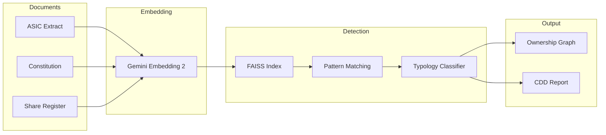
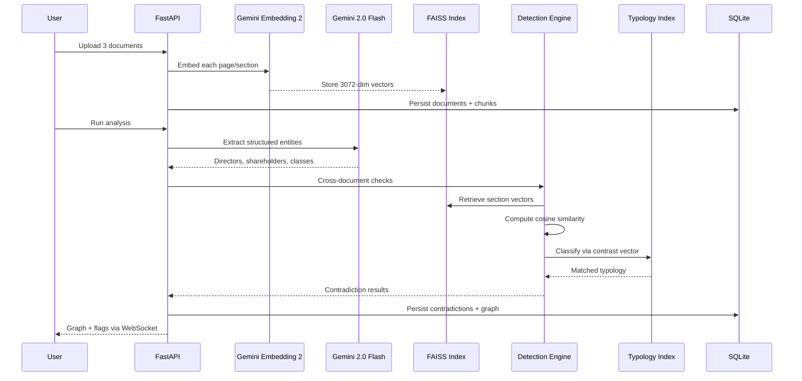
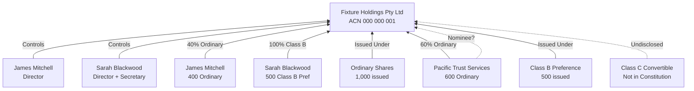
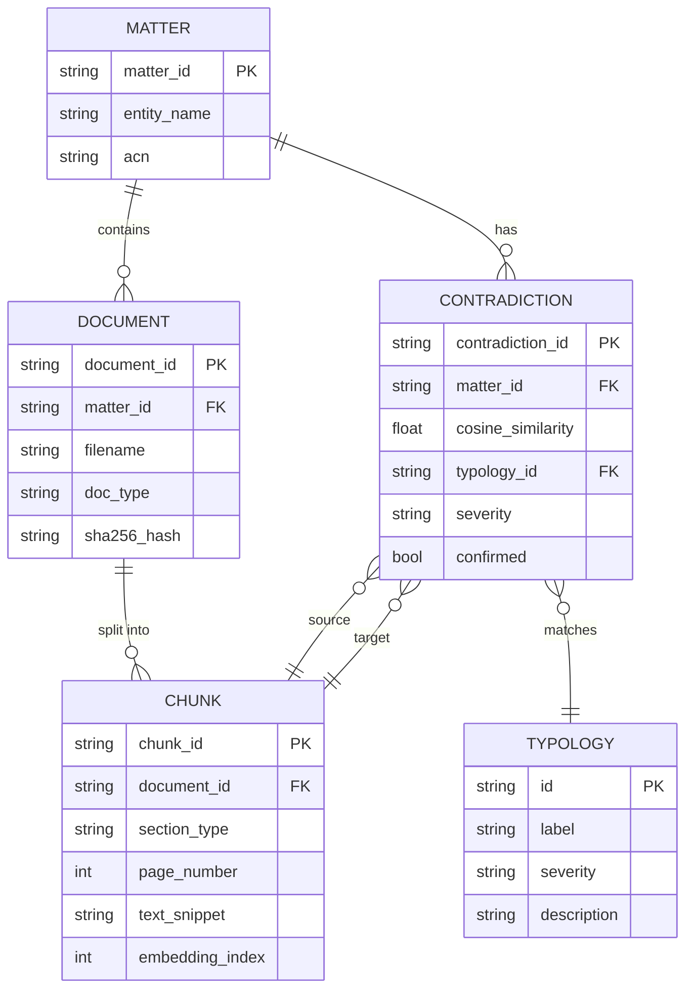

# STRATUM

Beneficial ownership contradiction detection for Australian law firm AML/CTF Tranche 2 compliance (effective July 2026).

STRATUM accepts three corporate documents for a client matter (ASIC company extract, company constitution, shareholder register), embeds all three using Gemini Embedding 2 into a single shared 3072-dimensional vector space, detects semantic contradictions across documents that indicate undisclosed beneficial ownership, and renders a live ownership graph with contradiction flags and matched AUSTRAC/FATF typologies.

## Quick Start

### Prerequisites

- Python 3.11+
- [Poppler](https://poppler.freedesktop.org/) for PDF rendering (`brew install poppler` on macOS)
- [Gemini API key](https://aistudio.google.com/apikey)

### Setup

```bash
git clone https://github.com/JohnJohnW/stratum.git
cd stratum
python3 -m venv .venv
source .venv/bin/activate
pip install -r backend/requirements.txt

cp .env.example .env
# Add your GEMINI_API_KEY to .env

uvicorn backend.main:app --reload --port 8000
```

Open [http://localhost:8000](http://localhost:8000) and click **Fixture B** to see three contradiction flags detected across the demo entity, or click **New Analysis** to upload your own documents.

## Features

- **Document upload**: Upload ASIC extracts, constitutions, and shareholder registers as PDFs via drag-and-drop
- **Gemini extraction**: Structured entity parsing using Gemini 2.0 Flash (directors, shareholders, share classes, governance rules)
- **Multimodal embedding**: PDF pages embedded as image+text pairs using Gemini Embedding 2 for cross-document comparison
- **Contradiction detection**: Keyword-pattern matching with embedding-based typology classification
- **Ownership graph**: Interactive Cytoscape.js graph with node popovers, edge thickness encoding, and legend filters
- **Source transparency**: View full raw document text, SHA-256 hashes, and individual embedded chunks
- **CDD report generation**: Downloadable PDF compliance report via WeasyPrint
- **Persistence**: SQLite database stores matters, documents, embeddings, and contradictions across server restarts
- **Demo fixtures**: Two pre-built scenarios (clean and 3 contradictions) for immediate exploration

## Architecture

### System Overview



### Contradiction Detection Pipeline



### Ownership Graph Structure (Fixture B)



### Data Model



## Environment Variables

| Variable | Required | Default | Description |
|----------|----------|---------|-------------|
| `GEMINI_API_KEY` | Yes | | Google AI API key for Gemini Embedding 2 and Gemini 2.0 Flash |
| `CONTRADICTION_THRESHOLD` | No | `0.65` | Cosine similarity threshold below which cross-document section pairs are flagged |

## Demo Walkthrough (Fixture B)

Fixture B loads **Fixture Holdings Pty Ltd** with three deliberately inconsistent documents that produce three contradiction flags:

**Flag 1: Nominee Shareholder Concealment (Critical)**

The shareholder register lists Pacific Trust Services Pty Ltd holding 600 Ordinary shares with a note that it acts as nominee for an undisclosed beneficial owner. The constitution contains no nominee provisions section and explicitly denies nominee arrangements exist.

**Flag 2: Undisclosed Share Class (High)**

The ASIC extract records three share classes (Ordinary, Class B Preference, Class C Convertible Preference). The constitution authorises only two classes (Ordinary and Class B Preference) and states that no other class is authorised without a special resolution.

**Flag 3: Director Authority Inconsistency (High/Critical)**

The ASIC extract records James Mitchell as Sole Director with sole signatory authority and unlimited transaction authority. The constitution requires a quorum of two directors and mandates dual director approval for any transaction exceeding $50,000.

## Why a Shared Vector Space?

The core architectural decision is embedding all document modalities (PDF page images, extracted text, table content) through a single model (`gemini-embedding-2-preview`) into one 3072-dimensional vector space.

Cosine similarity between vectors from different documents is only meaningful when both vectors were produced by the same model with the same training. Gemini Embedding 2 is a natively multimodal embedding model that processes text, images, and mixed content through a unified encoder, producing vectors that share geometric structure. When we compute `cosine(ASIC_officeholder_embedding, constitution_director_embedding)`, the resulting similarity score reflects genuine semantic alignment because both vectors occupy the same learned manifold.

The alternative (separate text and vision models fused at score level) would not produce the same result. Each model would produce vectors in its own learned space. Cosine similarity between vectors from different models is mathematically undefined because the dimensions do not correspond.

## Detection Approach

STRATUM uses a hybrid detection strategy that mirrors real production AML systems:

1. **Keyword-pattern detection** identifies candidate contradictions across document pairs. Corporate documents discussing the same topic (e.g. director authority) are always semantically similar, making pure threshold-based cosine similarity impractical for specific factual contradictions like sole vs dual director authority.

2. **Embedding-based typology matching** classifies each candidate against a FAISS index of AUSTRAC/FATF typology descriptions to name and explain the contradiction type.

3. **Cross-document cosine similarity** is reported as a distance metric showing how semantically different the two conflicting sections are.

## AUSTRAC/FATF Typologies

| ID | Label | Severity |
|----|-------|----------|
| `nominee_concealment` | Nominee Shareholder or Director Concealment | Critical |
| `layered_ownership` | Complex Layered Ownership Obscuring Control | High |
| `undisclosed_share_classes` | Inconsistent or Undisclosed Share Classes | High |
| `shelf_company_transfer` | Shelf Company Acquisition and Rapid Ownership Transfer | Medium |
| `trust_concealment` | Trust Structure Concealing Beneficial Ownership | Critical |

## API Endpoints

| Method | Path | Description |
|--------|------|-------------|
| `GET` | `/health` | Health check |
| `POST` | `/matters` | Create a new matter |
| `GET` | `/matters` | List all matters |
| `GET` | `/matters/{id}` | Get matter detail |
| `DELETE` | `/matters/{id}` | Delete a matter and all associated data |
| `POST` | `/upload/{doc_type}` | Upload a PDF document to a matter |
| `POST` | `/matters/{id}/analyse` | Run full pipeline: extraction, detection, graph building |
| `POST` | `/matters/{id}/detect` | Run contradiction detection only |
| `GET` | `/matters/{id}/graph` | Ownership graph JSON (Cytoscape.js format) |
| `GET` | `/matters/{id}/contradictions` | List detected contradictions |
| `POST` | `/matters/{id}/contradictions/{cid}/confirm` | Mark a contradiction as confirmed for CDD |
| `POST` | `/matters/{id}/generate-cdd` | Download CDD report as PDF |
| `GET` | `/demo?fixture=A\|B` | Load pre-embedded fixture documents |
| `WS` | `/ws/{id}` | Real-time graph and contradiction events |

## Tech Stack

- **Backend**: FastAPI, Pydantic, WebSockets
- **Persistence**: SQLite (matters, documents, embeddings, contradictions survive restarts)
- **Embedding**: Gemini Embedding 2 (`gemini-embedding-2-preview`), 3072-dimensional shared multimodal vector space
- **Extraction**: Gemini 2.0 Flash for structured entity parsing from corporate documents
- **Search**: FAISS (IndexFlatIP) for both per-matter document indexes and the typology index
- **PDF Processing**: pdf2image + pdfplumber for page rendering and text extraction
- **Report Generation**: WeasyPrint + Jinja2 for CDD PDF reports
- **Frontend**: React 18 (CDN, no build step), Cytoscape.js + dagre layout, Tailwind CSS
- **Deployment**: Docker, Cloud Run (australia-southeast1)

## Deployment

### Docker

```bash
docker build -t stratum -f backend/Dockerfile .
docker run -p 8080:8080 -e GEMINI_API_KEY=your-key -v stratum-data:/app/data stratum
```

### Cloud Run

```bash
gcloud builds submit --config cloudbuild.yaml \
  --substitutions _GEMINI_API_KEY=your-key
```

Note: Cloud Run containers are ephemeral. SQLite data will persist within a single container instance but will be lost on redeployment. For durable persistence in Cloud Run, mount a Cloud Storage FUSE volume or use a managed database.

## Limitations

- The `gemini-embedding-2-preview` model is in public preview and is not suitable for production workloads
- SQLite persistence is single-process: not suitable for multi-worker deployments
- The fixture documents are synthetic, and real ASIC extracts have different formatting that may require parser adjustments
- Contradiction detection uses keyword patterns tuned to the fixture data, so production use would require broader pattern coverage
- No authentication or multi-tenancy: this is a single-user application
- Cloud Run deployments lose SQLite data on redeployment unless a persistent volume is mounted

## Disclaimer

This application is a compliance analysis tool for demonstration purposes. It requires human review and is not an automated decision system. All findings should be independently verified by qualified legal and compliance professionals.

## License

MIT
